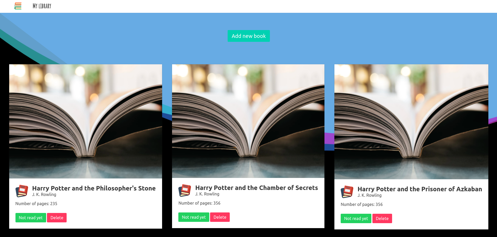

# JavaScript Library

> In this project we created a library app. It has the following fuctionalities:
- add new books to library;
- delete books from library;
- change status of the reading.

You can find the original description in [The Odin Project(https://www.theodinproject.com/courses/javascript/lessons/library)

## Built With

- HTML5 
- Sass
- JavaScript

## Live Demo

[Live Demo Link](https://rawcdn.githack.com/bruna-genz/library/47d90c98c7defbb50d187453aa29e7d9257a2ce0/index.html)

## Getting Started

To get a local copy up and running follow these simple example steps.
- open a new terminal and run the following command:
- `git clone https://github.com/bruna-genz/library.git`

### Prerequisites
- web browser

## Authors

:man: **Nicolás Mariño Parra**

- Github: [@nicolasmarino99](https://github.com/nicolasmarino99)
- Twitter: [@nicolasmarino99](https://twitter.com/nicolasmarino99)
- Linkedin: [Nicolás Mariño Parra](https://www.linkedin.com/in/nicol%C3%A1s-mari%C3%B1o-parra-45a707177/)

:woman: **Bruna Genz**

- Github: [@bruna-genz](https://github.com/bruna-genz)
- Twitter: [@Bruna_GK](https://twitter.com/Bruna_GK)
- Linkedin: [Bruna Genz](https://www.linkedin.com/in/brunagenz/)

## 🤝 Contributing

Contributions, issues and feature requests are welcome!

## Show your support

Give a ⭐️ if you like this project!
